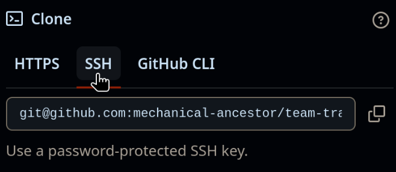
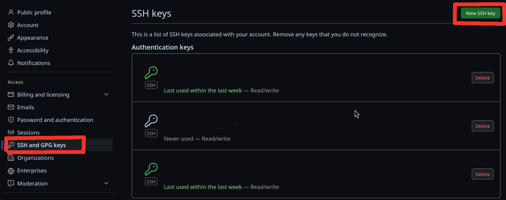
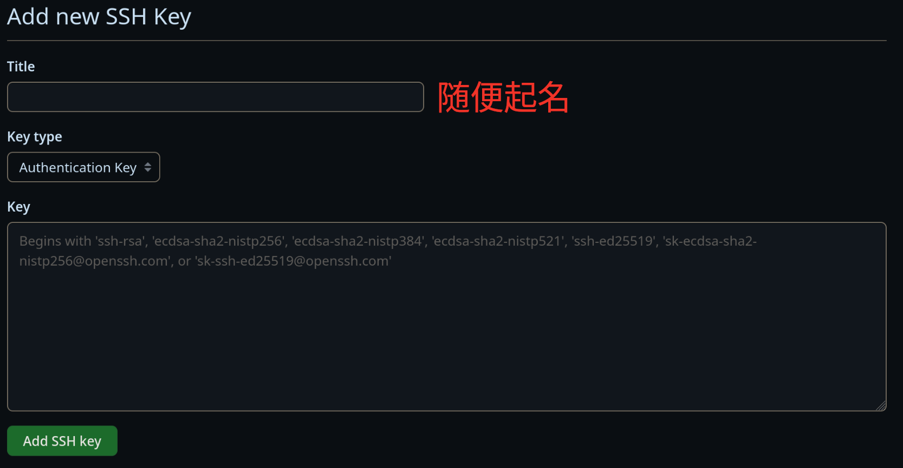
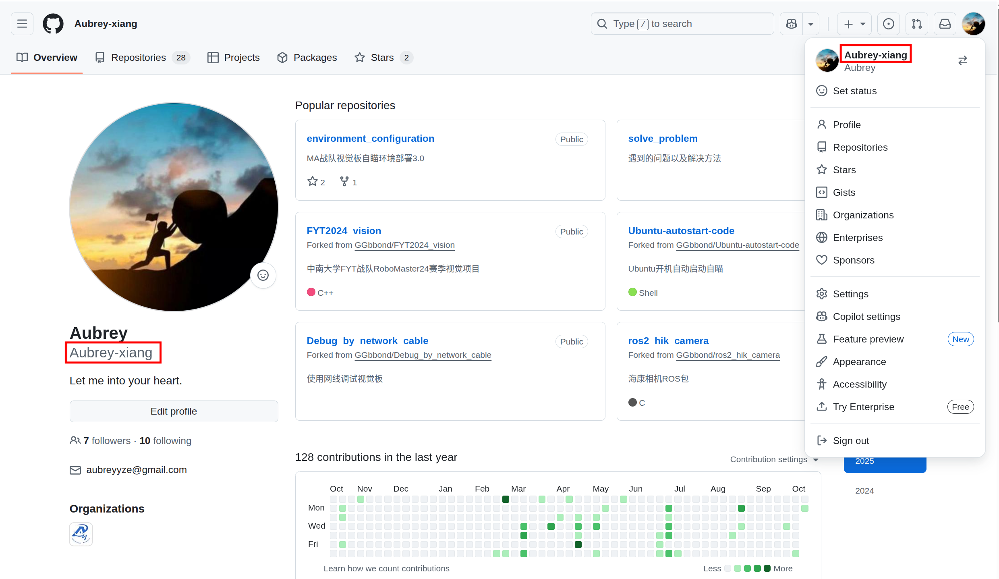

# 开始使用 GitHub

## 网络问题
可以尝试以下方法解决网络问题：
- Windows建议用，下载[`Watt Toolkit`](https://steampp.net/)免费加速GitHub，但是Linux里基本用不了。
- 科学上网，不方便细说

## 注册
[点此注册](https://github.com/join)
根据提示填写相关信息即可。

## 设置ssh密钥
### 为什么要设置ssh密钥
我们知道，要推送修改到GitHub仓库，首先肯定要验证你是谁，这样才能知道你有没有权限。

下面介绍三种GitHub支持的验证方式
- 密码认证
- ssh密钥认证
- 双因素(Two-factor)认证

由于GitHub在2021年8月13日以后[不再支持密码登录](https://github.blog/changelog/2021-08-12-git-password-authentication-is-shutting-down/)，而是推荐双因素认证。

由于https协议在推送提交时用的就是密码认证，导致用https协议Clone下来的仓库，在推送修改时如果没有[`设置远程推送URL`](../git/branch.md#设置远程推送URL)，
由于无法通过密码认证，导致无法推送。

但是如果使用ssh协议进行clone下来的仓库，就不需要输入用户名和密码，因为ssh协议使用你提前上传的ssh公钥进行认证。

为此我们可知，要使用ssh密钥认证，你需要：
- 生成ssh密钥对
- 将公钥上传到GitHub
- 用ssh协议Clone仓库，或者[`设置远程推送URL`](../git/branch.md#设置远程推送URL)



### 生成ssh密钥对
在终端输入以下命令，生成ssh密钥对：
```sh
ssh-keygen
```
然后如果没有特殊要求, 一路回车，默认即可。

这时候会在`~/.ssh`目录下生成两个文件：
- `id_ed25519`: 私钥
- `id_ed25519.pub`: 公钥

这时可以复制公钥内容，准备上传到GitHub。

<div class="warning"> 警告：

私钥千万不要泄露，泄露后任何人都可以用你的私钥登录你的GitHub账号，请妥善保管！
</div>

### 将公钥上传到GitHub
在GitHub点击头像，依次点击`Settings`，`SSH and GPG keys`，`New SSH key`按钮



- `Title`: 随便起名
- `Key`: 粘贴之前生成的ssh公钥(`id_ed25519.pub`)的内容



## 加入组织
 - 申请考核之前，是需要进入`mechanical-ancestor`组织的。

 - 提供你的github账号，我们即可邀请你进入mechanical ancestor(MA视觉组织)

 你的github账号如下图所示：
 

