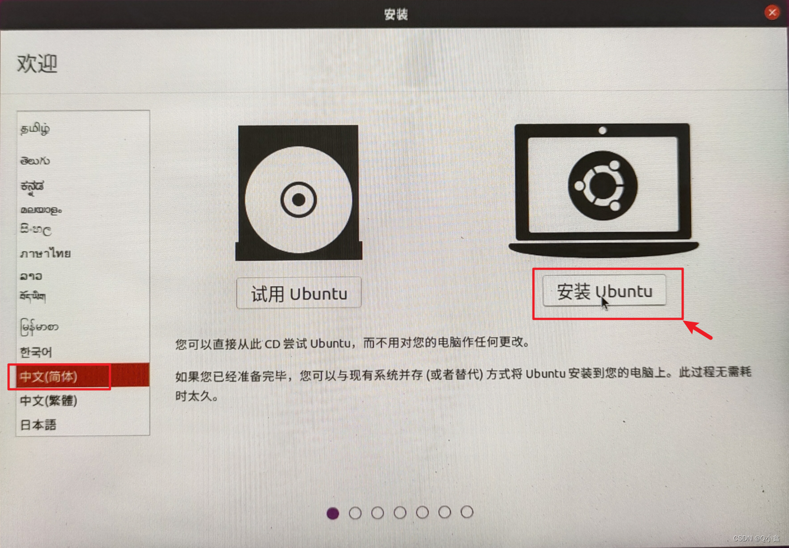
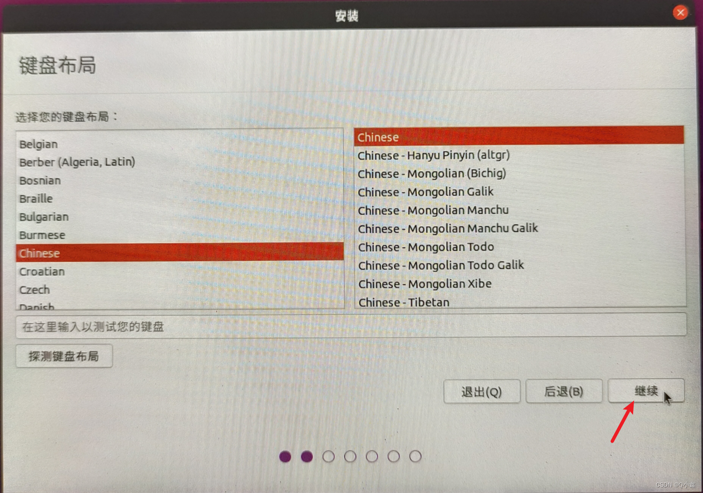
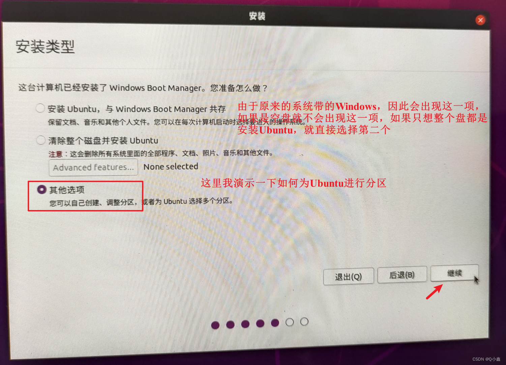
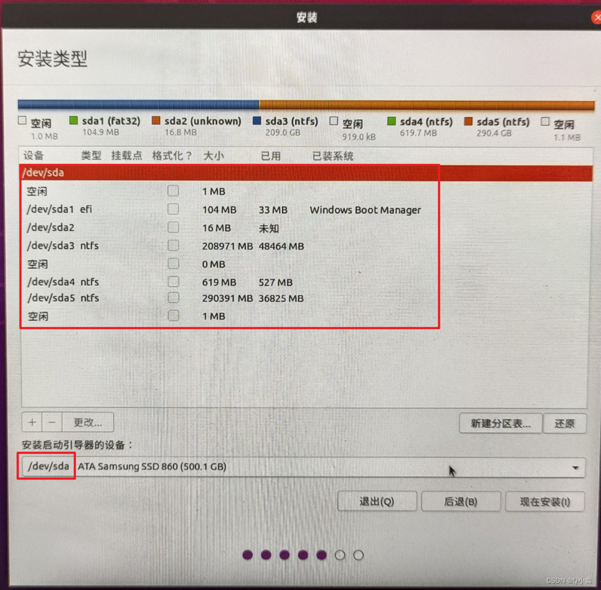
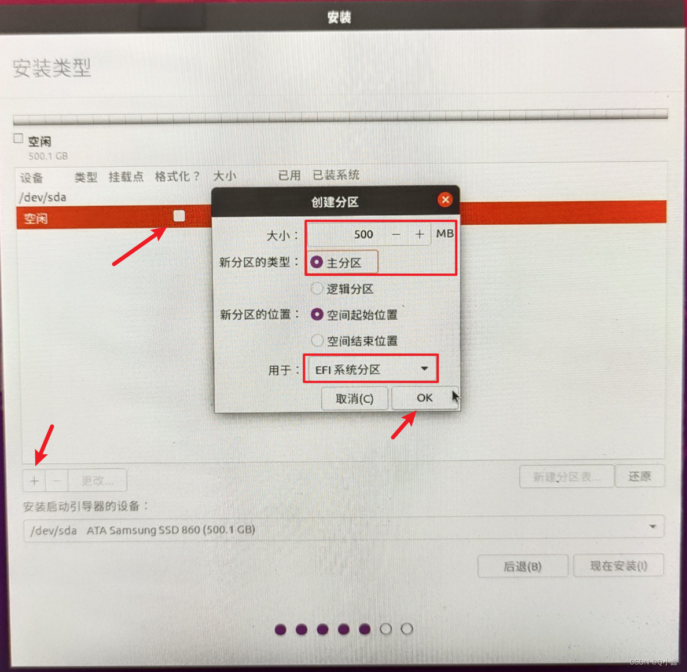
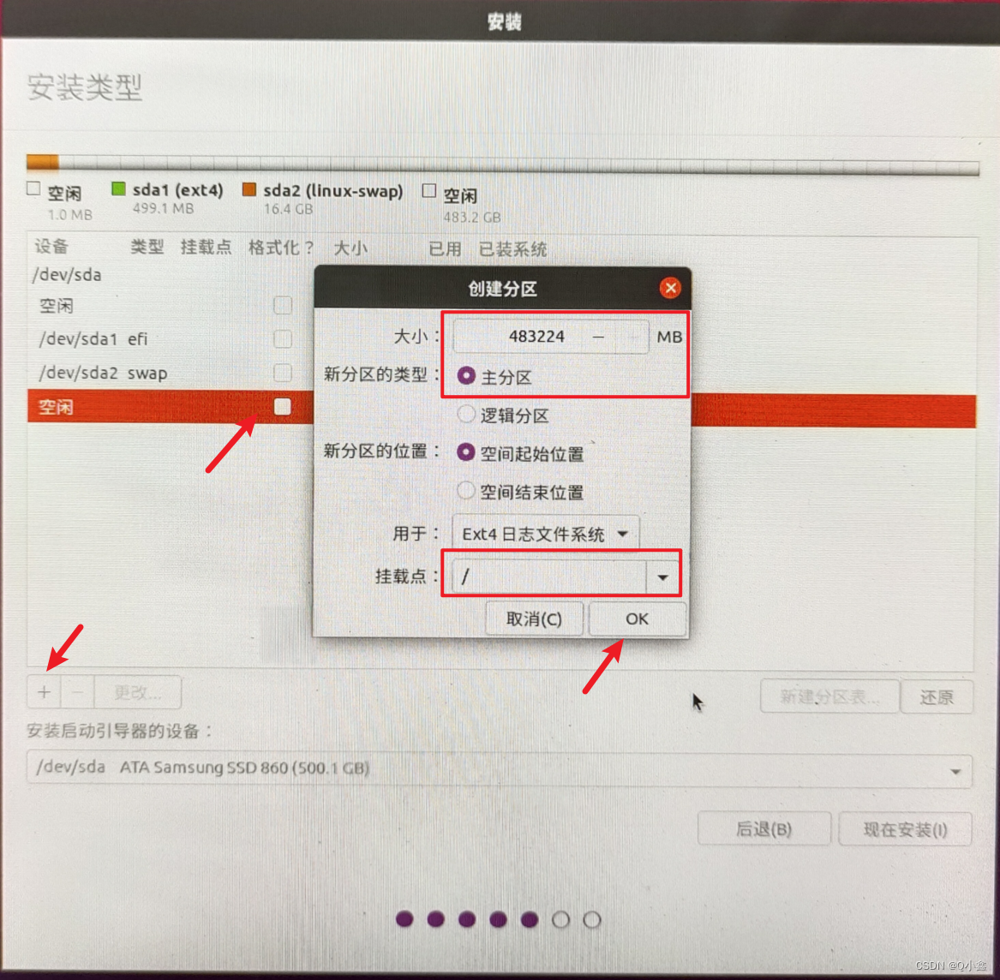
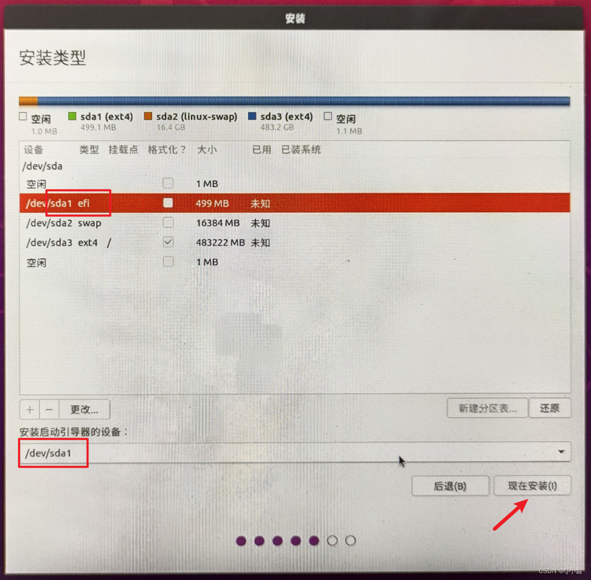
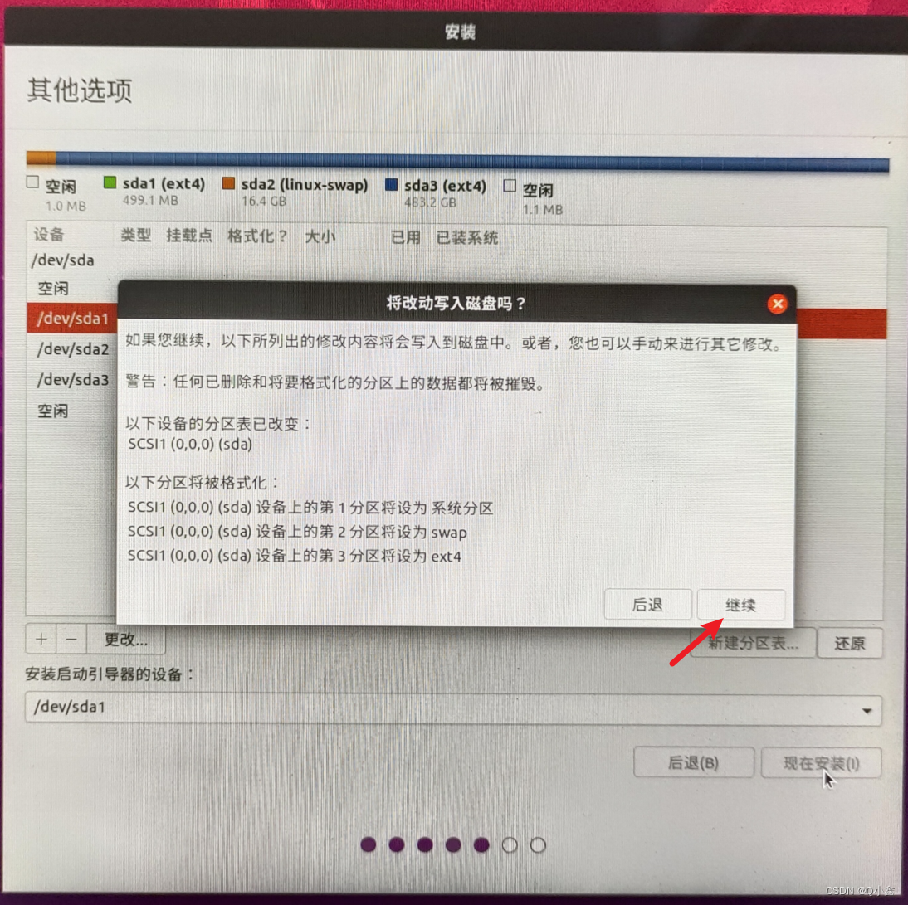
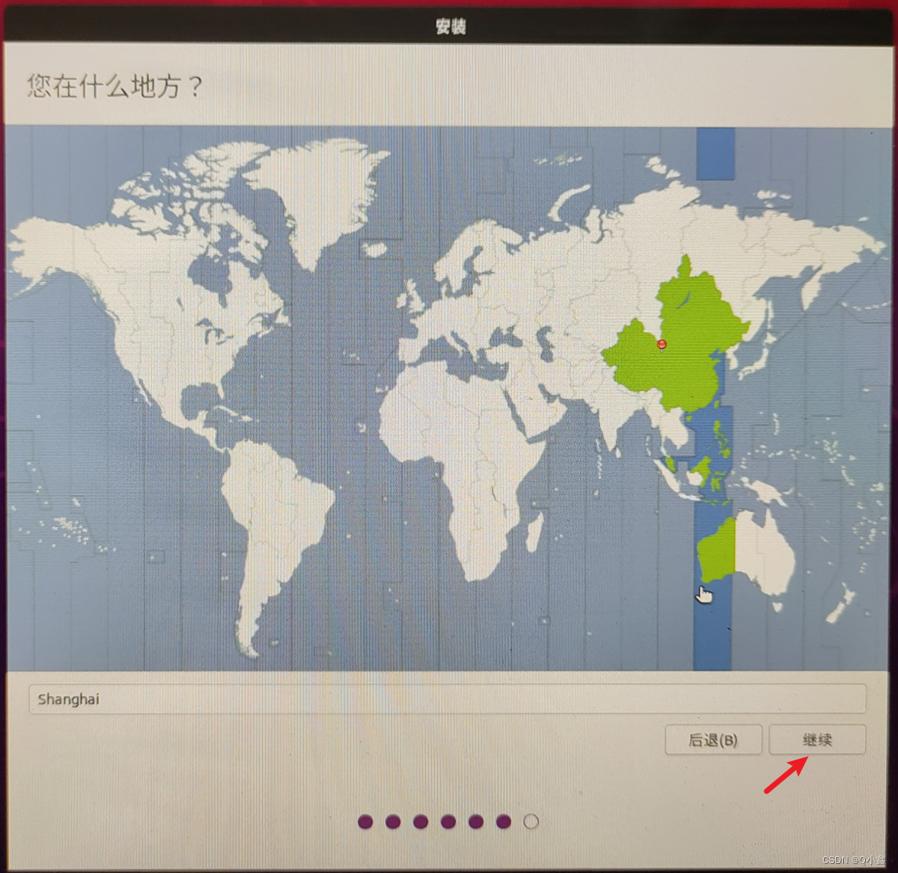
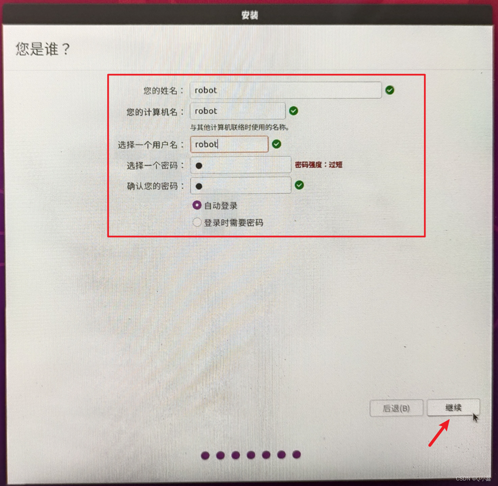

# ubuntu 安装指南

这里会介绍ubuntu的基本安装的步骤，

**对于不同的电脑会有不同的细节（问题），也会有相应的解决方案汇总**

|下载方式|优势|
|---|---|
|双系统安装|性能优势：双系统是直接在硬件上运行 Ubuntu，能充分利用电脑的硬件资源，如 CPU、显卡、内存等|
|虚拟机安装|便捷性强|


推荐双系统安装

## 双系统安装

### 1. 下载 Ubuntu 镜像

首先：我们需要一个<span style="color: rgba(242, 0, 255, 0.79); text-decoration: underline;">U盘</span>（8GB足够）
下载地址  
[官网](https://cn.ubuntu.com/download)

推荐镜像下载
[清华镜像](https://mirrors.tuna.tsinghua.edu.cn/ubuntu-releases/)
注：如何找镜像：
游览器直接搜，如  <span style="color: rgba(0, 162, 255, 0.61); text-decoration: underline;">清华大学开源软件镜像站</span>  
进入镜像站后直接搜, 如<span style="color: rgba(0, 174, 255, 0.59); text-decoration: underline;">ubuntu-releases</span>  

ubuntu镜像在官网也有链接

### 2. 制作启动盘

需要一个<span style="color: rgba(0, 217, 255, 0.58); text-decoration: underline;">烧录软件</span>，推荐使用下面这个：

[balenaEtcher官网](https://etcher.balena.io/)

其他烧录软件： 待补充

### 3. 划分空闲磁盘分区

#### a.在 Windows 系统中，右键点击 “此电脑”，选择 “管理”，进入 “磁盘管理”；​
    
#### b.找到有空闲空间的磁盘（如 D 盘），右键点击该磁盘，选择 “压缩卷”，输入压缩空间大小（建议 100GB 以上，单位为 MB，1GB=1024MB，如 100GB 需输入 102400）；​
    
#### c.压缩完成后，会出现一块 “未分配” 空间，无需进一步操作，关闭磁盘管理。​


### 4. 进入bios系统

#### a. 重启电脑，在开机画面出现时，快速按下启动快捷键（不同品牌电脑快捷键不同，常见的有 F2、F10、F12、Del，开机画面通常会提示）,进入bios系统（每个人的电脑不同，bios系统界面也不同）

|品牌|快捷键|
|----|----|
|拯救者|F2|
|华硕|F2或Del|


#### b. 打开bios高级设置界面，关闭安全启动（Secure boot）
#### c. 把电脑显卡模式改为混合模式或者或内显模式(因为装系统过程没有显卡驱动，会直接黑屏)

#### d. 更改优先启动，把原本的Window改为系统盘usb启动

### 5. 安装ubuntu系统

#### a.在U盘界面选择try or install ubuntu

#### b.





#### ***后续部分默认继续即可***



#### ***选择你上面分出来的空区域，一般是空闲，看旁边的大小来判断,点击“+”号进行分区***

#### c.★EFI系统分区

EFI分区通常位于磁盘的前部，因此我们需要第一创建。并且刚刚我们通过BIOS中的Boot得知，使用的是UEFI引导模式，因此创建EFI分区是必须的！大小通常设置为100MB到500MB即可

#### d.★ 根分区 
根分区是整个文件系统的根目录，所有的系统文件和用户数据都在这个文件系统下，因此主要的空间应该留给根分区.（主分区）













#### e.进入ubuntu系统:

在引导项选择第一个是ubuntu系统，第三个是windows系统，第二个是恢复ubuntu系统，第四个是bios系统，

### 6. 安装显卡驱动（可选，目前除5060显卡均可成功安装）

#### a. 进入ubuntu系统，打开终端，输入查看是否有显卡驱动
```bash
sudo apt update
```
```bash
sudo nvidia-smi
```
#### b. 如果没有的话，就输入
```bash
ubuntu-drivers devices
```
#### c.找到带recommended后缀的显卡驱动并且复制，输入

```bash
sudo apt install(推荐的显卡驱动)
```
```bash
sudo reboot 
```
