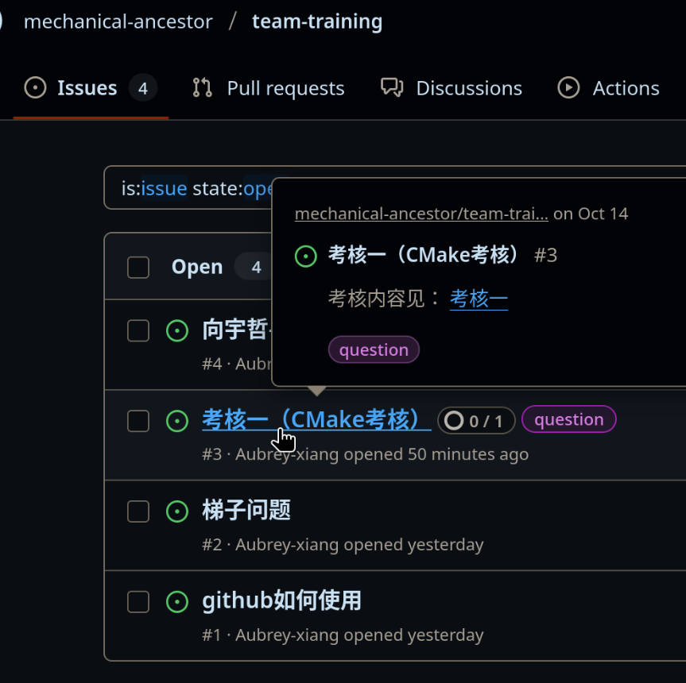
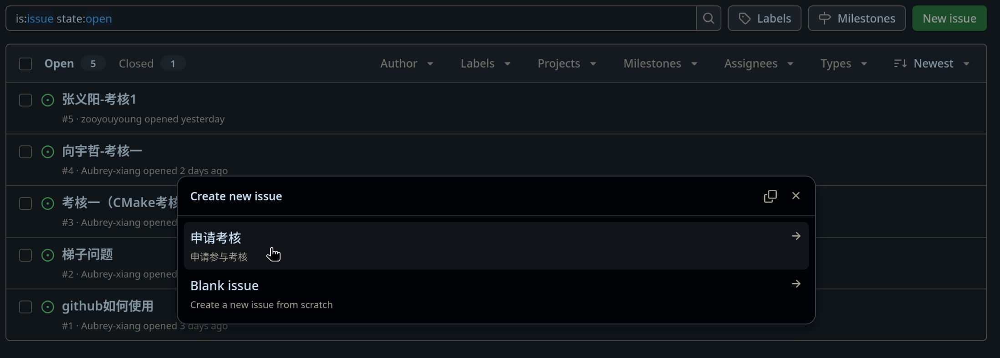
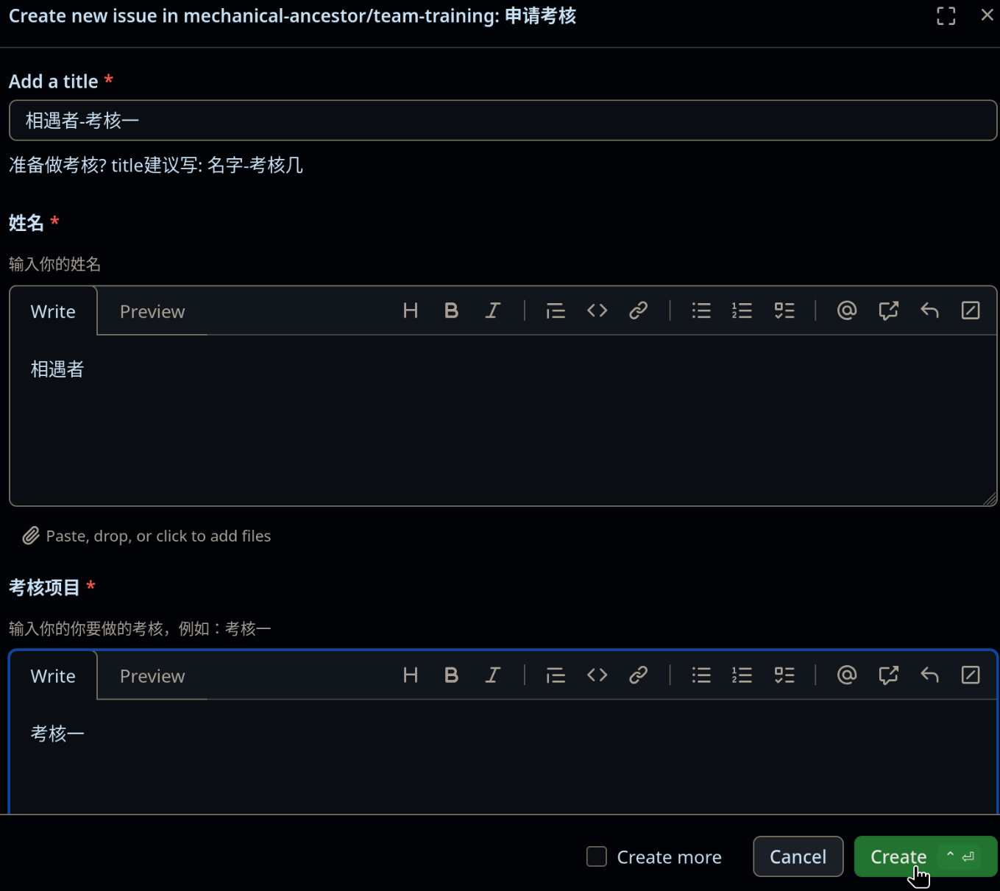
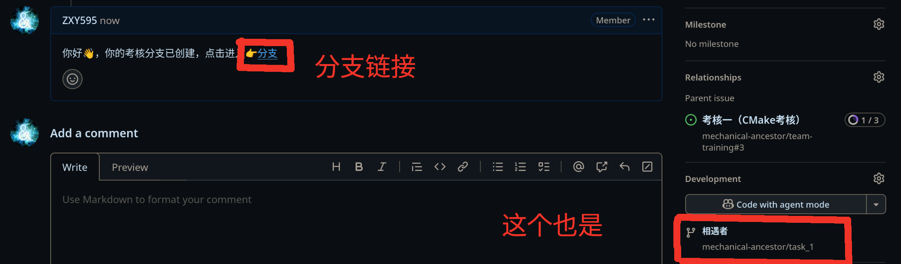
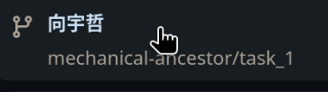
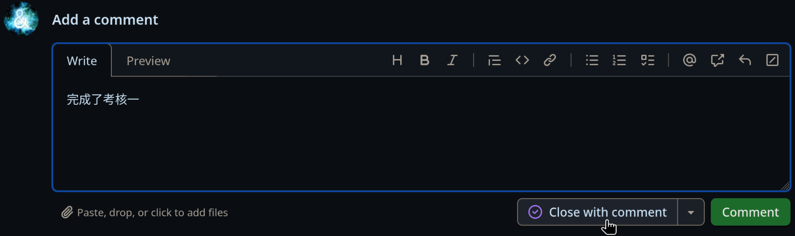

# 为什么考核要申请
这是为了方便追踪每个人的考核进度，提高考核效率，
    也帮助每个人提前熟悉分工明确的开发流程。

# 申请考核

## 查找考核issue

要完成一个考核，你需要在[考核文档仓库的Issue](https://github.com/mechanical-ancestor/team-training/issues)里找到对应的考核Issue,

***在这个issue中的介绍有一个链接，指向考核几的仓库***

## 创建问题

- ### 尝试创建问题
点击`New issue`按钮，再选择`申请考核`

- ### 填写问题标题和姓名
根据模板提示填写即可

最后点击`Create`

## [加入MA的Github组织](../github/getting-started.md#加入组织)

## 等待管理员创建分支

等待管理员为你创建开发分支，管理员创建后，一般会在你的Issue里留言，并留下创建的分支的链接，并且Github会通过邮件自动通知你，管理员的留言如下图：

## 进入分支，完成考核

进入这个branch，在这里完成你的考核

## 关闭问题，完成考核

完成后，先进入问题，然后在`Add a comment`中写下你的考核完成情况，例如完成了什么

然后点击`Close with comment`，即关闭问题。

