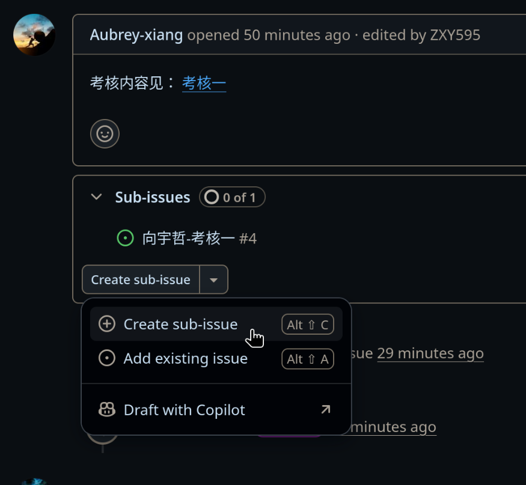
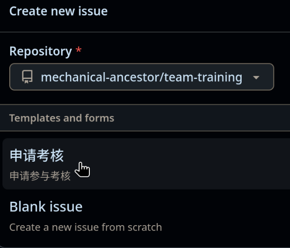
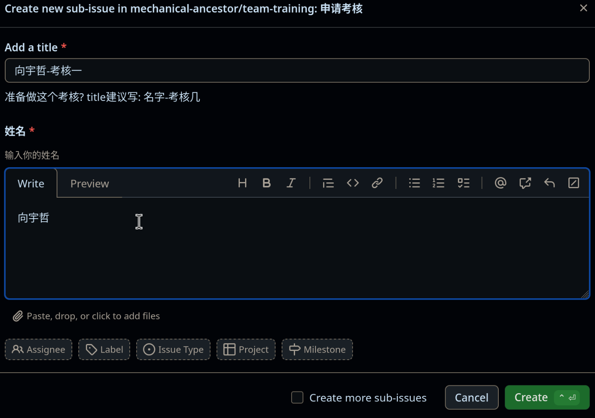
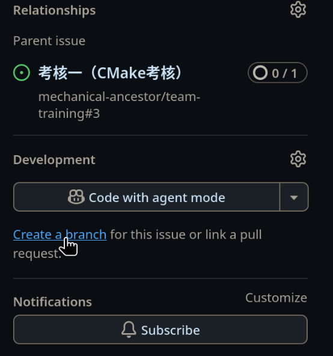
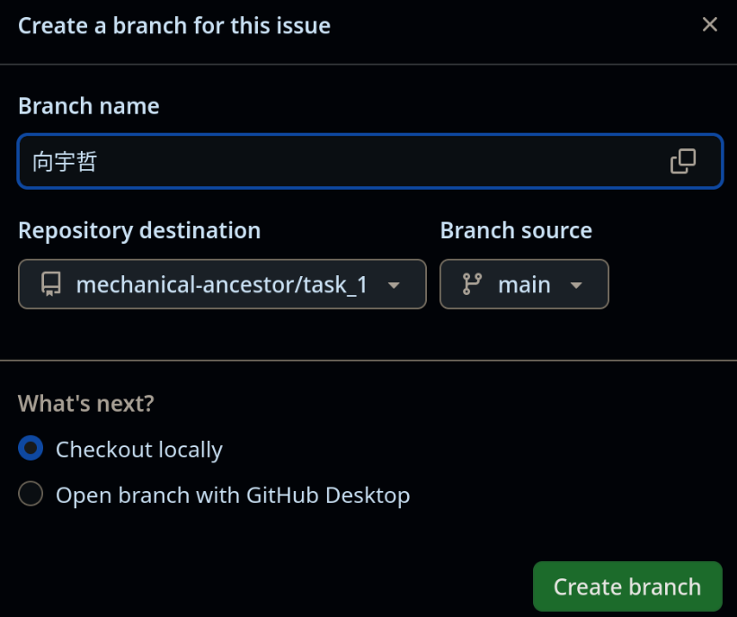

# 申请考核

## 查找考核issue

要完成一个考核，你需要在[考核文档仓库的Issue](https://github.com/mechanical-ancestor/team-training/issues)里找到对应的考核Issue,

## 创建子问题

- ### 考核仓库链接
***可以看到在issue中有一个链接，指向考核几的仓库，正如下图中的*** `考核一`

- ### 尝试创建子问题
点击`Create sub-issue`按钮，再选择`Create sub-issue`

- ### 选择模板

- ### 填写子问题标题和姓名
根据模板提示填写即可

最后点击`Create`

## 在子问题中创建分支

找到并进入你刚刚创建的子问题，尝试在偏右下的地方找到并点击`Create a branch`

注意一下几点：
- 创建分支时，`Branch name`就是你要创建的分支的名称，写什么都行[^name]，但要避免与其他人的分支名字冲突。
- Repository destination是目标仓库，也就是你的分支将被创建到的仓库，
    这里建议直接搜索[考核仓库](#考核仓库链接)的全名[^search]。
- Branch source是你要复制的分支，一般是main分支。

[^name]: 你上述创建的子问题已经包含了你的姓名，所以为了安全考虑，在创建其他东西例如分支和仓库等，你不需要再写自己的姓名。
    但为了避免与其他人的分支名字冲突，还是建议写上自己的姓名
[^search]: 由于这里选择仓库不智能，搜索仓库名又会搜索到Github上所有的仓库，
    所以建议这里直接搜索仓库全名，即`仓库所有者名/仓库名`，例如`mechanical-ancestor/task_1`

## 进入分支，完成考核

进入这个branch，在这里完成你的考核

## 关闭子问题，完成考核

完成后，先进入子问题，然后在`Add a comment`中写下你的考核完成情况，例如完成了什么

然后点击`Close with comment`，即关闭问题。

# 为什么考核要申请
这是为了方便追踪每个人的考核进度，提高考核效率，
    也帮助每个人提前熟悉分工明确的开发流程。
